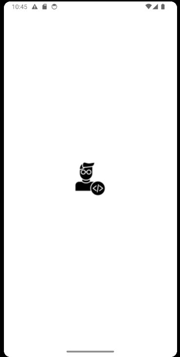

# I_AM_DEVELOPMENT

> Project with the aim of adding more knowledge and a way to challenge myself with new technologies. 

## Functionality
- [x] Show my Profile
- [x] Show some of my Skiils
- [x] Show my Contacts
- [x] When you click on my Email, you will be redirected to the emails application
- [x] When you click on Linkedin, it will your default browser and show my profile  

## Tecnologies Used
 1. [Flutter](https://flutter.dev/) 
 2. [Dart](https://dart.dev/)

## Layout
- Loading

- Home Screen

- Profile

- Some of skills

- Contacts

## Author

